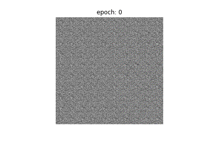
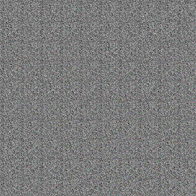
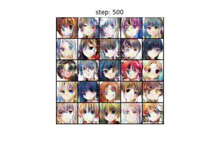
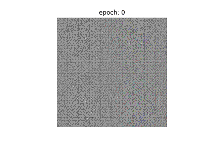
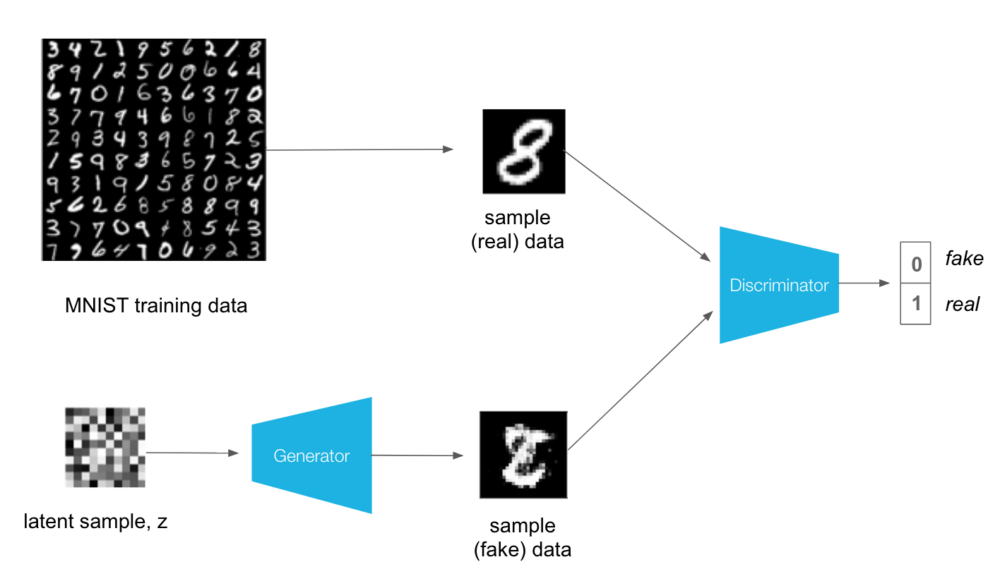
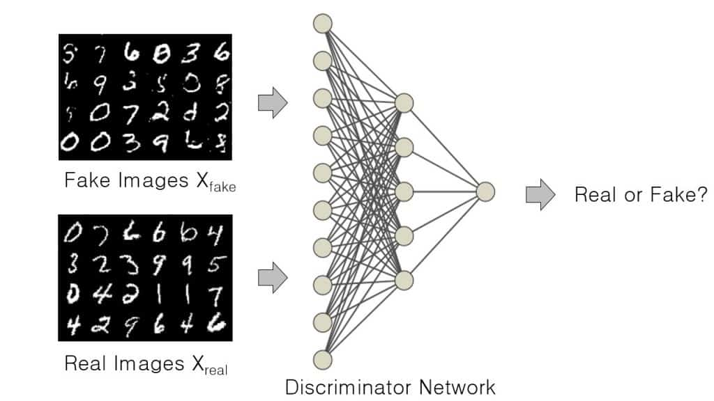
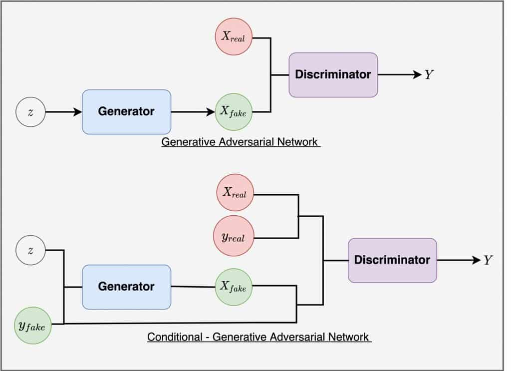
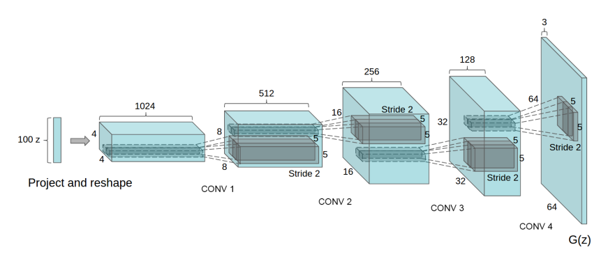

# **Generative Adversarial Networks (GAN)**

## **Index**
1. [GANs Overview](#gans-overview)
    - [Generator](#generator)
    - [Discriminator](#discriminator)
    - [Other GAN's variant](#gans-variant)
        - [cGAN](#cgan)
        - [DCGAN](#dcgan)
        - [cDCGAN](#cdcgan)
2. [Implementation and code description](#implementation)
3. [Installation and env preparation](#installation-and-virtual-environment-preparation)

<hr>

## **What you will see in this project** :fire: :see_no_evil:
<table>
    <tr>
    <td> Vanilla GAN</td>
    <td> cGAN</td>
    </tr>
    <tr>
    <td>
    <td>
    </tr>
</table>

<table>
    <tr>
    <td> Deep Convolutional GAN</td>
    <td> Conditional DCGAN</td>
    </tr>
    <tr>
    <td>
    <td>
    </tr>
</table>

<hr>

# **GANs Overview**
Generative Adversarial Netorks were originally introduced by 
[Goodfellow et al.](https://arxiv.org/abs/1406.2661) in 2014. He introduced GAN as a new framework for estimating generative models
via an adversarial process, in which a generative model G captures the data distribution, while a discriminative model D estimates if the sample came from the training data rather than G. <br>
In other word, GAN are a particular neural network that take random noise as input
and generate picture as outputs. This picture appear to be a sample from the distribution of the training set (e.g. MNIST or other image based dataset).
A GAN structure consist in two different (and with different scope) models which are
trained simultaneously and in an adversarial way:
- A **Generative model (also called Generator)** that captures the distribution
of training set.
- A **Discriminative model (also called Discriminator)** that estimates the probability that a sample is a real or a fake picture (e.g. is from training data or is generated by the other model).



<br>

## **Generator**
Generator is a Neural Network, which given a dataset $X_{real}$ tries to capture his distribution, by producing images $X_{fake}$ from noise Z as input. Noise input is a random set of values, usually sampled from a multivariate-gaussian distribution. This is often called latent vector and that vector space is called **latent space**. The GAN’s Generator acts quite like the decoder component of VAE: it project latent space to an image. The difference is that the Generator’s latent space is not forced to learn exactly a Gaussian distribution but it can learn and model more complex distribution.



<br>

## **Discriminator**
The Discriminator is more simple to understand than the Generator. The Discriminator is like a model trained to classify if an input image is real or is generated by another model. In other words the Discriminator is a binary classifier trained with a supervisioned classification mode. The Discriminator task is to predict a label (e.g. True or Fake or 0-1 label) from an input. While doing so, the supervisioned train gives to it a feedback and this permit the model to learn a set of parameters (weights and bias) in order to map the correct label. <br>
The principal scope of the Discriminator is to give a feedback to the Generator model, and to improve its generation phase. Therefore the Discriminator is used to train the Generator and after the training process, the Discriminator model is discarded as we are interested in the generator. Sometimes, the generator can be repurposed as it has learned to effectively extract features from examples in the problem domain. Some or all of the feature extraction layers can be used in transfer learning applications using the same or similar input data.


<br>

### **More Information about GAN**
To learn more about Training Phase and everythings else (also mathematical formula :dizzy_face:) you can read the `report.pdf` attacched in `report` directory.

<br>

# **GAN's variant**
## **cGAN**
Traditional GAN is trained in a completely unsupervised and unconditional fashion,
meaning no labels involved in the training process. Though the GAN model is capable of generating new realistic samples for a particular dataset, we have zero control
over the type of images [that are generated](https://learnopencv.com/conditional-gan-cgan-in-pytorch-and-tensorflow/#CGAN_TensorFlow).
This particular variant, Conditional GAN, were introduced by [Mehdi Mirza and
Simon Osindero](https://arxiv.org/abs/1411.1784). To understand the cGAN mechanism, think about a traditional GAN trained to generate images that match a dataset with handwritten number (e.g. MNIST dataset). With a GAN you pass a noise vector as input and you get an images as output. You don’t have power on the number that GAN will output to you (e.g. it may be a 9 or it may be a 1). Of course you can have explore the latent space and find the area of the distribution which you can sample a latent vector that will give you a specific number as output, but to obtain this you have to do a type of bruteforce until you find the area which corresponds to a certain number. This problem occurs with any dataset you used to train a GAN. The cGAN is a solution to this by giving some type of control on generation phase. In the next Figure we can see the differences on the structure of GAN and cGAN.



As you can see in the Figure, the Conditional GAN structure introduce an external information (all the other components is exactly the same as original GAN). This information could be a class label and is used to condition the model during the
training so that is possible to condition both the generation phase.

<br>

## **DCGAN**
Deep Convolutional Generative Adversarial Network, also know as DCGAN is a particular and new GAN’s architecture that improve his quality using convolutional
layers. It was introduced around 2016 by Alec Radford and other researcher in a paper published at [ICLR conference](https://arxiv.org/abs/1511.06434). The main components introduced in DCGAN is:
- **fractionally-strided convolutional layers** in the Generator, with the scope
of upsample the images.
- **strided convolutional layers** in the Discriminator, with the scope of downsample the images.



<br>

## **cDCGAN**
Conditional Deep Convolutional GAN is a conditional GAN that use the same con volution layers as DCGAN that is described previously. cDCGAN generate more realistic images than cGAN thanks to convolutional layers.

<br>

<hr>

# **Implementation**
After the brief introduction on GANs (i recommend you to read the report for more and thorough explainations), i will describe the implementations of all the described model. In this repository i give to you four implementations of GANs:
- ***Vanilla Gan***
- ***Conditional GAN***
- ***Deep Convolutional GAN***
- ***Conditional Deep Convolutional GAN***

As you can see in the main directory, there is a sub-directory for each model. In that directory there is a notebook (in which you can see the training phase and all the other operations to have a working GAN made by yourself) and also the `.py` files. <br> 
In the `.py` files you have a file for Discriminator's class, a file for the Generator's class and also a `main` file called with the name of the model. These `.py` file is made for give to you the possibility to execute and generate some samples from the GAN's Generator in your personal machine locally. <br>
The `main` file simply load the trained model of the Generator (that is saved in `trained_model` directory) and produce some samples to you, in order to see the power of these trained models.

You don't have to do anything for make it function, **you have just to start the main file**, for example:

```shell 
python3.10 DCGAN.py
```
(of course you have to move to the current dir where the main file is, in order to permit it to load the model from `trained_models` dir).

***Also if you want, you can retraine and do any possible experiments using the notebooks as a tutorial for make it easier to you.***

<hr>

## **Installation and virtual environment preparation**
1. Create a dir and download the project inside.
2. Create a virtual env in that directory
    ```shell 
    virtualenv GAN_env
    ```
3. Activate venv to install project requirements
    ```shell
    source GAN_env/bin/activate
    ```
4. Move to project dir and Install requiremenst
    ```shell
    pip install -r requirements.txt
    ```
5. Now you are ready to execute and test the project. <br>
    Example: **make some samples images using DCGAN**
    ```shell
    cd DCGAN
    python3.10 DCGAN.py
    ```
6. ***Enjoy*** :ghost:

<hr>

***Of course i'm available for every question or issue.***

<hr>

#### **References**
- <https://medium.com/swlh/gan-generative-adversarial-network-3706ebfef77e>
- <https://learnopencv.com/introduction-to-generative-adversarial-networks/>
- <https://learnopencv.com/conditional-gan-cgan-in-pytorch-and-tensorflow/#CGAN_TensorFlow>
- <https://learnopencv.com/deep-convolutional-gan-in-pytorch-and-tensorflow/>
- <https://github.com/Yangyangii/GAN-Tutorial>
- <https://github.com/bchao1/Anime-Face-Dataset>
- <https://machinelearningmastery.com/how-to-develop-a-conditional-generative-adversarial-network-from-scratch/>
